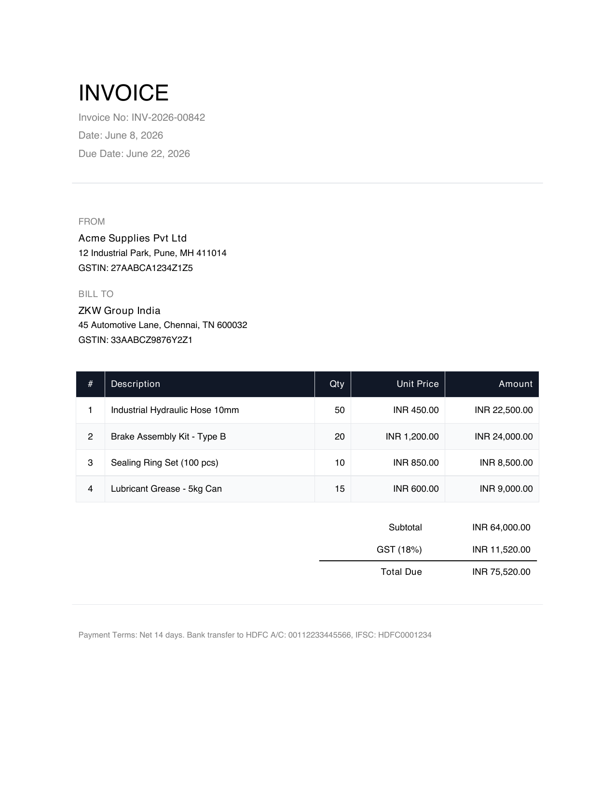
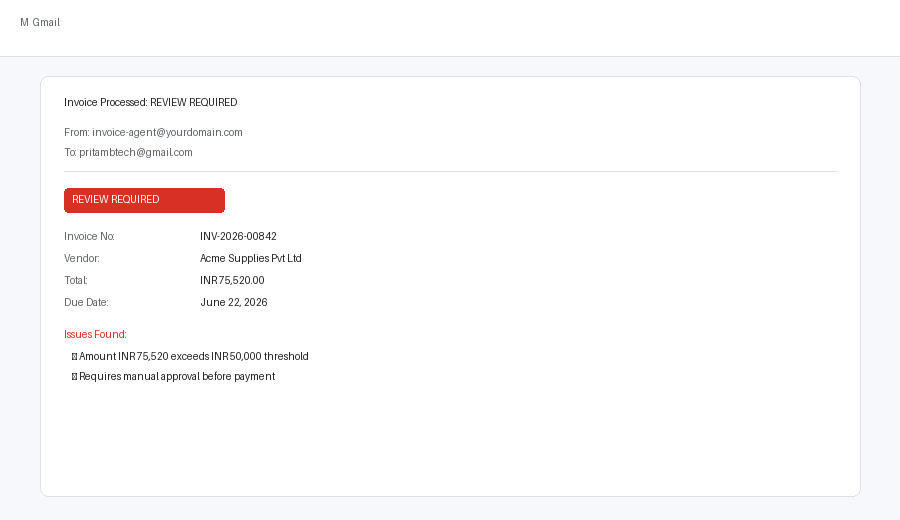
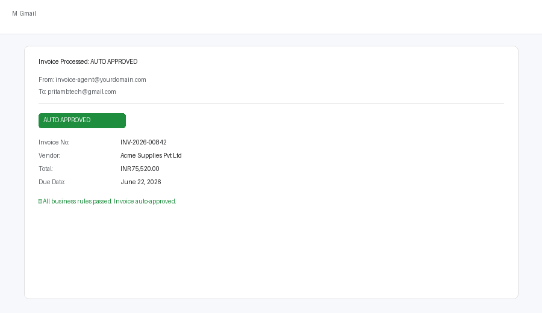

<div align="center">

# 🧾 n8n Invoice Processing Agent

**AI-powered invoice automation — from Gmail inbox to approval decision in seconds.**

[](https://n8n.io)
[](https://openai.com)
[](https://developers.google.com/gmail)
[](LICENSE)

</div>

---

## What It Does

This live n8n workflow monitors your Gmail inbox for invoice emails, reads the attached PDF, uses GPT-4o-mini to extract every field, runs 5 business-rule checks, then fires either a **REVIEW REQUIRED** or **AUTO APPROVED** response email — all without touching a spreadsheet.

```
Gmail Inbox  →  PDF Extract  →  AI Parse  →  Business Rules  →  Email Response + Log
```

---

## Workflow — n8n Canvas

<div align="center">

<br/>
<sub>Live n8n workflow: Gmail trigger → PDF extract → AI agent → business rules → routed email response</sub>
</div>

---

## Input — Sample Invoice PDF

<div align="center">

<br/>
<sub>A real test invoice sent as a Gmail attachment — INV-2026-00842 · Acme Supplies Pvt Ltd · INR 75,520</sub>
</div>

---

## Output — Gmail Response Emails

<table>
<tr>
<td align="center" width="50%">

### 🔴 Review Required



Triggered when total **> INR 50,000** or any field is missing/flagged

</td>
<td align="center" width="50%">

### 🟢 Auto Approved



Triggered when all 5 business rules pass cleanly

</td>
</tr>
</table>

---

## Business Rules

| # | Rule | Result |
|---|------|--------|
| 1 | Amount > INR 50,000 | 🔴 Review Required |
| 2 | Missing tax amount | 🔴 Review Required |
| 3 | Missing invoice number | 🔴 Review Required |
| 4 | Missing vendor GSTIN | 🔴 Review Required |
| 5 | Invoice is overdue | 🔴 Review Required |
| ✓ | All rules pass | 🟢 Auto Approved |

---

## Stack

| Layer | Tool |
|-------|------|
| Workflow automation | [n8n Cloud](https://n8n.io) |
| AI extraction | GPT-4o-mini via OpenAI API |
| LLM orchestration | LangChain (n8n AI Agent node) |
| Email trigger + send | Gmail OAuth API |

---

## Quick Setup

1. **Import** `invoice-workflow.json` into your n8n instance
2. **OpenAI** — add your API key on the Chat Model node
3. **Gmail** — connect OAuth on both the trigger and send nodes
4. **PDF node** — set *Input Binary Field* to `attachment_0`
5. **Publish** the workflow

---

## Testing

Send yourself an email with **"Invoice"** in the subject and a PDF attached.  
The Gmail trigger polls every 60 seconds.

| Test case | How to trigger |
|-----------|---------------|
| 🔴 REVIEW REQUIRED | Attach an invoice with total > INR 50,000 |
| 🟢 AUTO APPROVED | Attach an invoice with total < INR 50,000 and all fields present |

The sample invoice in this repo (`test-invoice.pdf`) triggers **REVIEW REQUIRED** — total is INR 75,520.

---

<div align="center">
<sub>Built by <a href="https://github.com/pritmon">pritmon</a> · n8n · OpenAI · Gmail API</sub>
</div>
