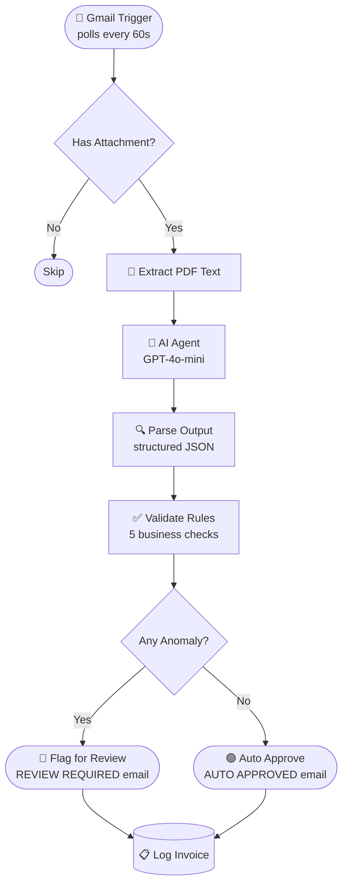

<div align="center">

# 🧾 n8n Invoice Processing Agent

**AI-powered invoice automation — from Gmail inbox to approval decision in seconds.**

[](https://n8n.io)
[](https://openai.com)
[](https://developers.google.com/gmail)
[](LICENSE)

</div>

---

## What It Does

This live n8n workflow monitors your Gmail inbox for invoice emails, reads the attached PDF, uses GPT-4o-mini to extract every field, runs 5 business-rule checks, then fires either a **REVIEW REQUIRED** or **AUTO APPROVED** response email — all without touching a spreadsheet.

```
Gmail Inbox  →  PDF Extract  →  AI Parse  →  Business Rules  →  Email Response + Log
```

---

## Features

- **Zero-touch inbox monitoring** — Gmail trigger polls every 60 seconds, skips emails with no attachment
- **AI field extraction** — GPT-4o-mini reads raw PDF text and returns structured JSON (vendor, amount, tax, GSTIN, due date, invoice number)
- **5-rule validation engine** — amount threshold, missing fields, overdue date — all checked automatically
- **Dual routing** — flags for human review or auto-approves and logs, no manual sorting needed
- **Audit log** — every invoice decision is recorded for traceability

---

## Workflow — n8n Canvas

<div align="center">

<br/>
<sub>Live n8n workflow: Gmail trigger → PDF extract → AI agent → business rules → routed email response</sub>
</div>

---

## How It Works



### Node-by-node

| Step | Node | What happens |
|------|------|-------------|
| 1 | **Gmail Trigger** | Polls inbox every 60 s, fires on new emails |
| 2 | **Has attachment?** | Routes away emails with no PDF attached |
| 3 | **Extract PDF text** | Reads binary attachment, outputs raw text |
| 4 | **AI Agent** | Sends PDF text to GPT-4o-mini with extraction prompt |
| 5 | **OpenAI Chat Model** | GPT-4o-mini processes and returns structured data |
| 6 | **Parse Output** | Converts AI response to usable JSON fields |
| 7 | **Validate Rules** | Runs all 5 business-rule checks |
| 8 | **Any anomaly?** | Branches on pass/fail |
| 9a | **Flag for review** | Sends REVIEW REQUIRED email with reason |
| 9b | **Auto approve** | Sends AUTO APPROVED confirmation email |
| 10 | **Log invoice** | Records decision for audit trail |

---

## Business Rules

| # | Rule | Result |
|---|------|--------|
| 1 | Amount > INR 50,000 | 🔴 Review Required |
| 2 | Missing tax amount | 🔴 Review Required |
| 3 | Missing invoice number | 🔴 Review Required |
| 4 | Missing vendor GSTIN | 🔴 Review Required |
| 5 | Invoice is overdue | 🔴 Review Required |
| ✓ | All rules pass | 🟢 Auto Approved |

---

## Input — Sample Invoice PDF

<div align="center">

<br/>
<sub>A real test invoice sent as a Gmail attachment — INV-2026-00842 · Acme Supplies Pvt Ltd · INR 75,520</sub>
</div>

---

## Output — Gmail Response Emails

<table>
<tr>
<td align="center" width="50%">

### 🔴 Review Required


Triggered when total **> INR 50,000** or any field is missing/flagged

</td>
<td align="center" width="50%">

### 🟢 Auto Approved


Triggered when all 5 business rules pass cleanly

</td>
</tr>
</table>

---

## Stack

| Layer | Tool |
|-------|------|
| Workflow automation | [n8n Cloud](https://n8n.io) |
| AI extraction | GPT-4o-mini via OpenAI API |
| LLM orchestration | LangChain (n8n AI Agent node) |
| Email trigger + send | Gmail OAuth API |

---

## Repo Structure

```
n8n-invoice-processing-agent/
├── invoice-workflow.json   # importable n8n workflow — all nodes & config
├── test-invoice.pdf        # sample invoice (INR 75,520 · triggers REVIEW)
├── assets/
│   ├── invoice-sample.png         # screenshot of the test PDF
│   ├── gmail-review-required.png  # example REVIEW REQUIRED email
│   └── gmail-auto-approved.png    # example AUTO APPROVED email
└── README.md
```

---

## Quick Setup

1. **Import** `invoice-workflow.json` into your n8n instance
2. **OpenAI** — add your API key on the Chat Model node
3. **Gmail** — connect OAuth on both the trigger and send nodes
4. **PDF node** — set *Input Binary Field* to `attachment_0`
5. **Publish** the workflow

---

## Testing

Send yourself an email with **"Invoice"** in the subject and a PDF attached.  
The Gmail trigger polls every 60 seconds.

| Test case | How to trigger |
|-----------|---------------|
| 🔴 REVIEW REQUIRED | Attach `test-invoice.pdf` (total INR 75,520 — over threshold) |
| 🟢 AUTO APPROVED | Attach an invoice with total < INR 50,000 and all fields present |

---

<div align="center">
<sub>Built by <a href="https://github.com/pritmon">pritmon</a> · n8n · OpenAI · Gmail API</sub>
</div>
